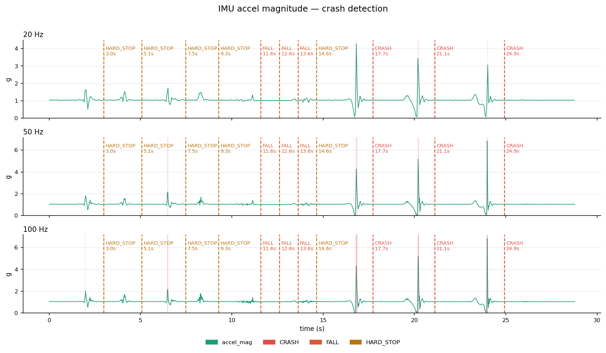

# crash_imu

Real-time crash, fall, and hard-stop detection for a Segway-style personal vehicle, running on a Raspberry Pi with a BerryIMU. The classifier samples IMU data at 100 Hz, fuses in barometer and GPS readings, and writes paired CSV and MCAP logs that can be replayed in [Foxglove Studio](https://foxglove.dev/).

## Hardware

- Raspberry Pi (any model with I2C)
- BerryIMU — v1, v2, v3, or 320G (auto-detected)
- BMP388 barometer *(optional)*
- uBlox CAM-M8 GPS via `gpsd` *(optional)*
- USB speaker for the crash alert tone *(optional)*

## Install

```bash
git clone https://github.com/Mobile-Entertainment-LLC/crash_imu.git
cd crash_imu
chmod +x setup.sh
./setup.sh
```

`setup.sh` installs the apt packages, enables I2C, starts `gpsd`, and pip-installs `mcap`.

## Run

```bash
python3 segway_behavior_classifier.py
```

Flags:

| Flag | Effect |
|---|---|
| `--hz 100` | sample rate (default 100 Hz) |
| `--no-gps` | skip GPS |
| `--no-baro` | skip barometer |
| `--no-sound` | silence the crash beep |
| `--idle-min 5` | pause recording after N minutes idle |

Outputs land in `~/crash_imu/recordings/` as paired `ride_<timestamp>.csv` and `ride_<timestamp>.mcap` files.

## Live output

```
STATE        |a|(g)  |w|(dps)   roll  jerk(g/s)  recording
------------------------------------------------------------
GOOD           1.01      2.3    1.2        0.4  RECORDING
GOOD           1.00      1.8    1.1        0.2  RECORDING
WATCHING       2.34     45.1   12.5       18.7  RECORDING
>>> EVENT: HARD_STOP  (peak |a|=2.34g, peak jerk=18.7 g/s) <<<
```

`Ctrl+C` ends the session and prints a verdict tally.

## Results

A 28.8-second ride captured and classified in real time. The system flagged **11 events**:

| Verdict | Count |
|---|---|
| HARD_STOP | 5 |
| FALL | 3 |
| CRASH | 3 |



The plot overlays verdict events on the accelerometer magnitude trace, downsampled to 20 / 50 / 100 Hz. Higher sample rates catch sharp jerk transients that lower rates smooth over — visible in the CRASH cluster between 17 and 25 seconds.

## Visualization

Generate a plot from any ride CSV:

```bash
python3 plot_ride.py recordings/ride_<timestamp>.csv
```

## Files

- **`segway_behavior_classifier.py`** — main entry point. Samples the IMU at 100 Hz, fuses in barometer (10 Hz) and GPS (1 Hz) data, classifies events live, and writes paired CSV + MCAP logs.
- **`plot_ride.py`** — matplotlib script that loads a ride CSV and renders a 3-panel plot of accelerometer magnitude at 20 / 50 / 100 Hz with verdict events overlaid.
- **`IMU.py`** — unified BerryIMU driver. Auto-detects the board version on startup and dispatches reads to the correct sensor module.
- **`BMP388.py`** — lightweight BMP388 barometer driver (temperature, pressure, altitude) over I2C using `smbus2`.
- **`LSM6DSL.py`**, **`LSM6DSV320X.py`**, **`LSM9DS0.py`**, **`LSM9DS1.py`**, **`LIS3MDL.py`** — register maps and init routines for each sensor variant a BerryIMU can ship with.
- **`setup.sh`** — one-shot installer: apt packages, pip packages, I2C enable, gpsd enable.
- **`requirements.txt`** — Python pip dependencies (just `mcap`).

## Detection thresholds

Tunable in `segway_behavior_classifier.py`:

| Constant | Default | Meaning |
|---|---|---|
| `TRIGGER_ACCEL_G` | 2.0 g | enters WATCHING window |
| `TRIGGER_JERK_GPS` | 25 g/s | jerk-based trigger |
| `CRASH_PEAK_ACCEL_G` | 4.0 g | crash classification threshold |
| `CRASH_PEAK_JERK_GPS` | 40 g/s | crash jerk threshold |
| `FALL_ROLL_DEG` | 30° | fall classification threshold |
| `HARD_STOP_PEAK_G` | 0.7 g | hard-stop threshold |
